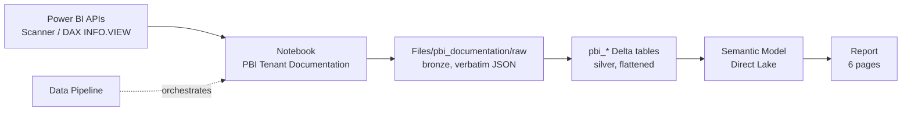

# PBI Tenant Catalog

A deployable Microsoft Fabric solution that scans a Power BI / Fabric tenant and turns it
into a **queryable data dictionary** — workspaces, reports, semantic models, tables,
columns, DAX measures (with expressions), calculated columns, relationships, RLS roles,
M/Power Query expressions, data sources and lineage — surfaced through a Direct Lake
semantic model and a six-page report.

Deploy it into any tenant with one command.

## Architecture



Raw JSON is landed **first and untouched**, so an API schema change never loses data —
the flatten step can always be re-run against previously landed files.

### Scan modes

| Mode | API | Requirement | Coverage |
|---|---|---|---|
| `admin` | Scanner API (`/admin/workspaces/getInfo`) | Caller is a Fabric Administrator | Whole tenant |
| `user` | Workspace REST + DAX `INFO.VIEW.*` | Workspace Member + XMLA read | Accessible workspaces only |

`MODE = "auto"` (the default) probes for admin rights and falls back automatically.

## Repository layout

```
Deploy-PBICatalog.ps1          # one-command deployment into any tenant
_items_inventory.json          # source items (type, displayName, id) — must stay beside definitions/
definitions/                   # exported Fabric item definitions
  Lakehouse/PBICatalogLakehouse/
  Notebook/PBI Tenant Documentation/
  DataPipeline/PBI Tenant Documentation Pipeline/
  SemanticModel/PBI Tenant Catalog/      # TMDL
  Report/PBI Tenant Catalog/             # PBIR
.github/skills/deploy-pbi-catalog/       # lets Copilot deploy on request
```

Folders under `definitions/` follow Fabric's own `<ItemType>/<ItemName>/` shape, so each one
maps 1:1 to an item the script creates. The hashed `ReportSection*` and `visuals/*` folder
names inside the report are generated by Power BI — leave them as they are.

## Prerequisites

In the **target** tenant:

- PowerShell 7+ (`pwsh`) and Azure CLI, logged in: `az login --tenant <tenant>`
- An active **Fabric or Premium capacity** — required for both Direct Lake and notebook execution
- Permission to create workspaces (or an existing workspace to deploy into)

For a **tenant-wide** scan, additionally:

- Caller holds the **Fabric Administrator** role
- Admin portal → Tenant settings → **Admin API settings**:
  - *Enhanced admin APIs responses with detailed metadata* → **Enabled**
  - *Enhanced admin APIs responses with DAX and mashup expressions* → **Enabled** (this is what returns DAX)

Without these the notebook still runs, but only covers workspaces the caller can access.

## Deploy

Review the plan first — it makes no changes:

```pwsh
az login --tenant <target-tenant>

pwsh -File ./Deploy-PBICatalog.ps1 `
  -WorkspaceName "PBI Catalog" `
  -CapacityName  "<your-capacity>" `
  -PlanOnly
```

Then deploy:

```pwsh
pwsh -File ./Deploy-PBICatalog.ps1 `
  -WorkspaceName "PBI Catalog" `
  -CapacityName  "<your-capacity>" `
  -ExpectedTenantId "<tenant-guid>"
```

Or just ask Copilot: *"deploy the PBI catalog to my tenant"* — the bundled skill drives
the same script.

### Parameters

| Parameter | Purpose |
|---|---|
| `-WorkspaceName` | Target workspace; created if missing (needs a capacity) |
| `-WorkspaceId` | Deploy into an existing workspace instead |
| `-CapacityName` / `-CapacityId` | Capacity for a newly created workspace |
| `-ExpectedTenantId` | Abort if the signed-in tenant differs — use for customer work |
| `-SkipPipelineRun` | Deploy artifacts without running the scan |
| `-PipelineTimeoutMinutes` | Default 120; raise for large tenants |
| `-PlanOnly` | Print the plan and rebind map, change nothing |

### What the script does

```
Lakehouse → Notebook → DataPipeline → [RUN PIPELINE] → SemanticModel → Report
```

The pipeline runs **before** the semantic model is created, because every model table is
a Direct Lake partition over the `pbi_*` Delta tables the notebook produces. It then
verifies those tables landed before publishing the model and report.

`SQLEndpoint` is auto-provisioned with the Lakehouse and is never created directly.

## Output

### Delta tables

| Table | Model table |
|---|---|
| `pbi_workspaces` | Workspace |
| `pbi_reports` | Report |
| `pbi_semantic_models` | Semantic Model |
| `pbi_tables` | Model Table |
| `pbi_columns` | Model Column |
| `pbi_measures` | Measure |
| `pbi_calculated_columns` | Calculated Column |
| `pbi_model_parameters` | Model Parameter |
| `pbi_datasources` | Data Source |
| `pbi_permissions` | Permission |
| `pbi_date` | Date |

Plus `Files/pbi_documentation/data_dictionary_<run_id>.md` and the raw JSON under
`Files/pbi_documentation/raw/<run_id>/`.

### Report pages

Tenant Overview · Model Explorer · Measure Catalog · Data Dictionary · Governance & Access · Report Activity

## Rebinding

The deployment rewires eight references across four files so the deployed copy never
points at the source workspace:

| File | Rebound |
|---|---|
| `notebook-content.py` | `default_lakehouse`, `default_lakehouse_workspace_id` |
| `pipeline-content.json` | `notebookId`, `workspaceId` |
| `expressions.tmdl` | OneLake path `.../{workspaceId}/{lakehouseId}` |
| `definition.pbir` | `semanticmodelid`, workspace name in the connection string |

Source identifiers are discovered at runtime, not hard-coded, so the script keeps working
if you re-export a modified solution.

> The workspace **name** is replaced only inside `definition.pbir`. A global replace would
> corrupt visual titles and text boxes across the report's ~110 parts. GUIDs are replaced
> globally; the display name is not.


## Troubleshooting

**Report is empty / model returns no data.** The scan produced no `pbi_*` tables. Check
the notebook run output and confirm the two Admin API tenant settings are enabled.

**Items export as `NotSupported`.** If the capacity is paused, `getDefinition` returns
400/404 and the export script misreports it as `NotSupported`. Resume the capacity and
re-export. Only `SQLEndpoint` is genuinely unsupported.

**Export fails with `Premium capacity connection health issue`.** The capacity is paused
or unhealthy. Resume it and retry.

**Export fails with 403 `ItemHasProtectedLabel`.** An encryption-enforcing sensitivity
label blocks export. Remove or downgrade the label on that item and re-run. A report's
label is independent of the label on its semantic model.

**Deployment created duplicates.** The script creates items, it does not update in place.
Delete the existing items or workspace before redeploying.

**Item creation fails with odd 400/404s.** Confirm the target capacity is running.

## License

[MIT](LICENSE). Provided as is, without warranty — see the licence text for the full
disclaimer.
